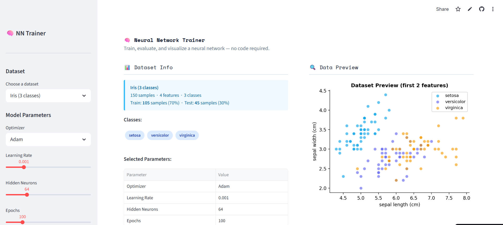
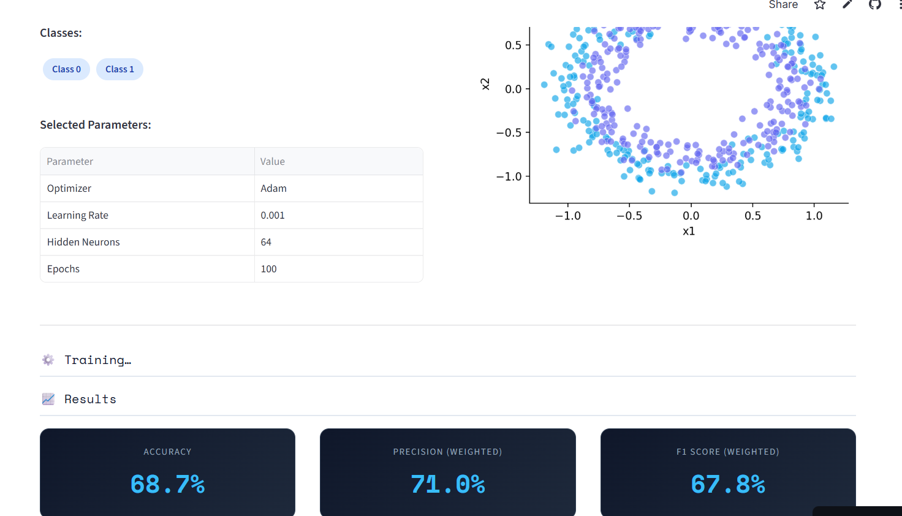
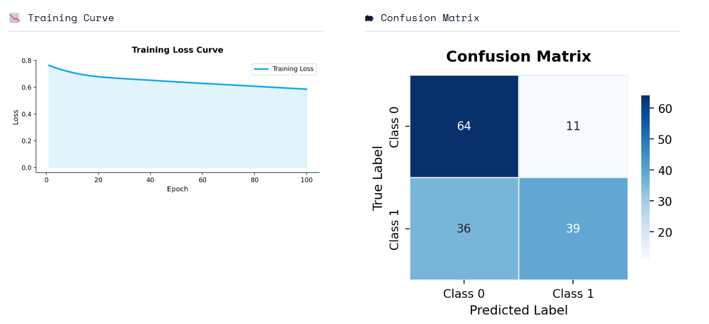
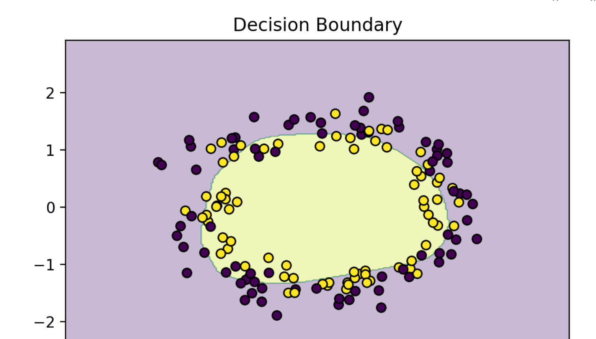

# 🧠 Neural Network Trainer


An interactive **Machine Learning training dashboard** that allows users to train and visualize a neural network on multiple datasets **without writing any code**.

Built with **Streamlit** and **Scikit-learn**, the app enables users to experiment with neural network hyperparameters and instantly observe model performance through interactive visualizations.

## 🌐 Live Demo

👉 **Try the app:**
https://nn-trainer.streamlit.app/

---

## 📸 Application Preview

### Dataset Selection



### Training Results



### Confusion Matrix



### Decision Boundary



## 🚀 Features

* Multiple built-in datasets
* Automatic **70/30 train-test split**
* Neural network training using **MLPClassifier**
* Adjustable hyperparameters

### Users can configure:

* Optimizer
* Learning rate
* Hidden neurons
* Epochs

### Visualizations include:

* Training loss curve
* Confusion matrix
* Accuracy, Precision, F1 score
* Test prediction preview
* Decision boundary visualization

---

## 📚 Supported Datasets

| Dataset       | Type                       |
| ------------- | -------------------------- |
| Iris          | Multi-class classification |
| Wine          | Multi-class classification |
| Breast Cancer | Binary classification      |
| Circles       | Nonlinear dataset          |
| Moons         | Nonlinear dataset          |
| Blobs         | Cluster dataset            |

---

## 🏗 Project Structure

```
nn-trainer/
│
├── app.py
├── requirements.txt
└── README.md
```

---

## ⚙️ Tech Stack

| Technology   | Purpose                        |
| ------------ | ------------------------------ |
| Streamlit    | Web interface                  |
| Scikit-learn | Neural network model           |
| NumPy        | Numerical computing            |
| Pandas       | Data processing                |
| Matplotlib   | Plotting                       |
| Seaborn      | Confusion matrix visualization |

---

## ▶️ Run Locally

Clone the repository

```
git clone https://github.com/your-username/nn-trainer.git
cd nn-trainer
```

Install dependencies

```
pip install -r requirements.txt
```

Run the application

```
streamlit run app.py
```

The app will open at:

```
http://localhost:8501
```

---

## ☁️ Deployment

The project is deployed using **Streamlit Cloud**.

Steps:

1. Push project to GitHub
2. Open https://share.streamlit.io
3. Connect your GitHub repository
4. Select **app.py** as the main file

---

## 🎯 Learning Objectives

This project demonstrates:

* Neural network training workflows
* Hyperparameter experimentation
* Model evaluation techniques
* Interactive ML dashboards
* Deploying ML apps to the cloud

---

## 📌 Future Improvements

Potential enhancements:

* Upload custom dataset (CSV)
* Model comparison dashboard
* Download trained model
* Multiple hidden layers
* Training vs validation curve

---

## 👩‍💻 Author

**Yamya Patel**

Computer Science and Business Systems
RGPV University

